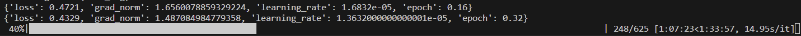
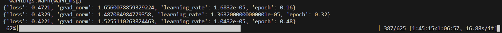
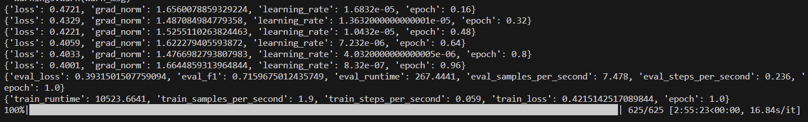

# Hangul Corrector

Hangul Corrector는 한국어 문장의 맞춤법 및 문법을 교정하는 AI 기반 웹 서비스입니다.  
BERT 기반의 KLUE 모델을 활용한 멀티라벨 분류 모델로 학습되며, 학습된 모델을 웹 인터페이스를 통해 실시간으로 테스트할 수 있습니다.

---

## 목차
 1. 프로젝트 개요
 2. 환경 설정
 3. 데이터 준비
 4. 모델 학습
 5. 웹 서비스 실행
 6. 참고 자료

---

## 1. 프로젝트 개요
 - 목표: 한국어 문장의 맞춤법, 띄어쓰기, 문법 오류를 교정
 - 모델: `klue/bert-base` BERT 모델 기반 멀티라벨 분류
 - 기능:
  - CSV 데이터를 학습하여 모델 생성
  - 멀티라벨 분류로 다양한 오류 유형 동시에 교정

 - 만들게된 이유 : 맞춤법 검사기 쓸때마다 항상 글자 수 때문에 불편했어서 내가 직접 만들면 글자 수 제한을 없앨 수 있지 않을까? 해서 만들게 되었다.

---

## 2. 환경 설정

2.1 Python 설치(작성된 코드들은 3.11.9 버전에서 작성됨)
   - 설치 후 환경변수 확인:
     ```bash
     python --version
     ```
2.2 가상환경 생성 (권장)
   ```bash
   python -m venv venv
   ```
 2.3 가상환경 활성화
 - Windows
 ```bash
 .\venv\Scripts\activate
 ```
 - macOS/Linux
 ```bash
 source venv/bin/activate
 ```
 2.4 필요한 패키지 설치
 ```bash
 pip install --upgrade pip
 pip install -r requirements.txt
 ```

---
## 3. 데이터 준비
 - preprocess.py를 실행해서 데이터 셋을 csv파일 형태로 변환 (processed/train.csv, processed/val.csv)
 -  데이터 셋의 경우 [AI Hub](https://aihub.or.kr/) 사이트에서 자연어 분석 후처리용 과교정 검증 데이터를 다운받아서 사용했음
 - csv 형식:
    - sentence: 교정할 문장
    - labels: 오류 유형 (멀티라벨, ;로 구분)

## 4. 모델 학습
 4.1 학습 스크립트 실행
 ```bash
 python src/train_model.py
 ```
 - 학습 로그
 
 
 
 4.2 주요 사항
 - 학습 시 labels는 float 형식으로 변환하여 BCEWithLogitsLoss와 호환
 - Trainer의 compute_metrics는 f1_score 기반 평가
 - 학습 완료 후 model_output/ 폴더에 모델 저장

## 5. 웹 서비스 실행
 5.1 Flask 기반 서버 실행
 ```bash
 python src/web_inference.py
 ```
 5.2 웹 브라우저 접속
 ```bash
 http://127.0.0.1:5000
 ```
 5.3 기능
 - 문장 입력 후 오류 분석 및 교정 클릭
 
 - 모델이 교정한 문장 및 오류 유형 출력
  

 ## 6. 참고 자료
 - [AI Hub](https://aihub.or.kr/)
 - [KLUE BERT](https://github.com/klue-benchmark/klue)
 - [Huggingface Transformers](https://huggingface.co/docs/transformers)
 - [PyTorch](https://pytorch.org/)
 - [Flask](https://flask.palletsprojects.com/en/stable/)

 ## License
 이 프로젝트는 MIT license로 배포됩니다.  
 자세한 내용은 LICENSE 파일을 참고하세요.